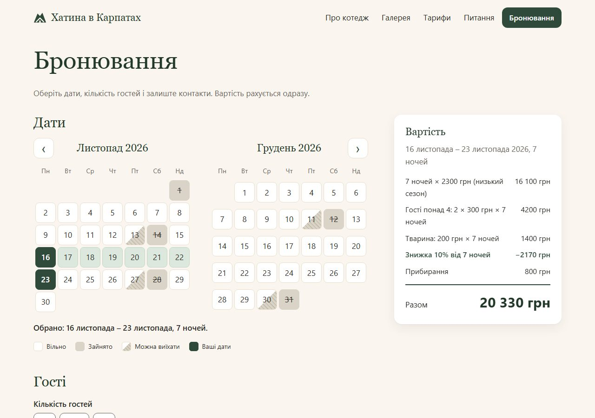
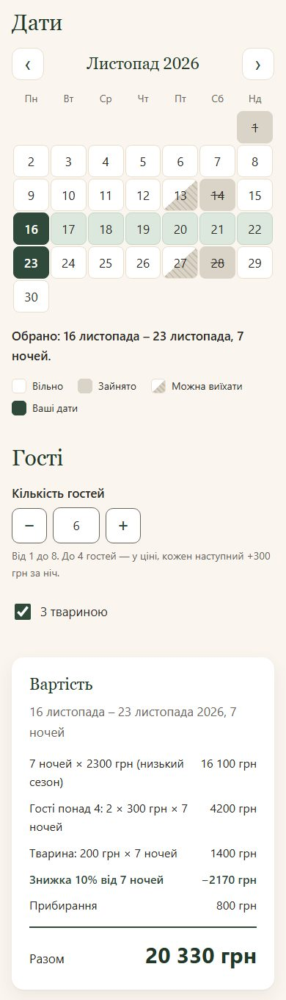

# Хатина в Карпатах

Демо-сайт котеджу з календарем бронювання й калькулятором вартості. Гість обирає дати, бачить зайняті ночі, кількість гостей і тварину — ціна перераховується одразу, а наприкінці сайт формує готовий текст запиту на бронювання.

Тестове завдання на вакансію Junior AI Web Developer. Код написано разом з AI-асистентом (Claude Code); журнал рішень — у [PROMPTS.md](PROMPTS.md).

**Живий сайт:** https://creative-piroshki-9fc8c4.netlify.app

> **Усе на сайті вигадане:** назва, ціни, дати бронювань, адреса, телефон і пошта. Форма нікуди нічого не надсилає.

## Скріншоти

| Головна | Бронювання |
|---|---|
|  |  |



## Що вміє

- **Головна:** опис котеджу, галерея, тарифи (таблиця і «стрічка року» з сезонами пропорційно кількості днів), відповіді на питання.
- **Календар:** зайняті ночі, дні «можна лише виїхати», вибір заїзд → виїзд, 12 місяців уперед, 1 або 2 місяці залежно від місця.
- **Калькулятор:** ночі за сезонними тарифами, доплата за гостей понад 4 і за тварину, прибирання, знижка 10% від 7 ночей.
- **Перевірки:** мінімум ночей за сезоном, кількість гостей, ім'я й телефон (`+380XXXXXXXXX` або `0XXXXXXXXX`). Поки є помилки, кнопка «Забронювати» заблокована.
- **Підтвердження:** зведення, «Копіювати запит», «Змінити дані».
- **Чернетка:** дати, гості, тварина, ім'я й телефон зберігаються в `localStorage` цього браузера.

## Стек

Чистий HTML, CSS і JavaScript (ES-модулі). Без фреймворків, без збірки, без залежностей і без бекенду. Шрифти системні, дані — JSON-файли в `data/`.

## Структура

```
index.html              головна
booking.html            сторінка бронювання
css/style.css           усі стилі, змінні кольорів у :root
js/pricing.js           розрахунок вартості (чисті функції)
js/calendar.js          календар: зайнятість, вибір дат, клавіатура
js/booking-logic.js     валідація, текст запиту, відновлення чернетки (без DOM)
js/booking.js           зв'язує інтерфейс сторінки бронювання
data/pricing.json       сезони, тарифи, доплати, знижка
data/bookings.json      демо-бронювання (жовтень 2026 – травень 2027)
tests/                  тести на Node.js без залежностей
assets/                 фото (AVIF), логотип, favicon, og.jpg, скріншоти
```

## Як запустити

Сайт треба відкривати через локальний сервер: ES-модулі й `fetch` не працюють, якщо відкрити файл подвійним кліком (сторінка бронювання в цьому разі покаже підказку).

```bash
python -m http.server 8000
# або
npx serve .
```

Потім відкрийте http://localhost:8000.

## Тести

Потрібен Node.js 18 або новіший (перевірено на 24). Встановлювати нічого не треба — використано вбудований `node:test`.

```bash
node tests/pricing.test.js    # розрахунок вартості
node tests/tariffs.test.js    # тарифи в index.html збігаються з data/pricing.json
node tests/calendar.test.js   # календар: зайняті ночі, межі, сітка місяців
node tests/booking.test.js    # телефон, ім'я, текст запиту, чернетка
```

Ручний чеклист — у [TESTING.md](TESTING.md).

## Ключові рішення

- **Ціна рахується лише в `js/pricing.js`.** `calculatePrice` — чиста функція: отримує дати, гостей, тварину й тарифи, повертає розбивку, підсумок і список помилок. Порушення правил (замало ночей, забагато гостей) повертаються разом із ціною, щоб інтерфейс показав і суму, і причину; некоректні дати — лише помилкою.
- **Правила ночей.** Ніч належить даті, коли лягаєш спати; день виїзду — не ніч. Якщо дати захоплюють кілька сезонів, діє найбільший мінімум ночей. Знижка діє на ночі й доплати, але не на прибирання, і округлюється до гривні.
- **Дати** — рядки `YYYY-MM-DD`, обчислення в UTC, «сьогодні» передається параметром, тому тести не залежать від дати запуску.
- **У день чужого виїзду можна заїхати**, якщо того ж дня не починається інше бронювання.
- **Тарифи на головній** записані в HTML (працюють без JavaScript), а `tests/tariffs.test.js` перевіряє, що таблиця, стрічка року й доплати збігаються з `data/pricing.json`.
- **Безпека введення:** ім'я й телефон виводяться лише через `textContent`. Чернетка при відновленні перевіряється: дати в минулому або вже зайняті скидаються, решта даних лишається. Усі звернення до `localStorage` — у `try/catch`.
- **Свіжі дані:** JSON завантажується з `cache: 'no-cache'`, щоб після зміни тарифів браузер не показував старі ціни.

## Доступність

- Семантична розмітка, посилання «Перейти до вмісту», `alt` у фото, підписи до всіх полів.
- Помилки біля полів пов'язані через `aria-describedby`, поле з помилкою має `aria-invalid`.
- Календар з клавіатури: ←/→ — день, ↑/↓ — тиждень, PageUp/PageDown — місяць, Home/End — початок і кінець тижня. Кожен день має повний підпис для скрінрідера («9 жовтня 2026, п'ятниця, зайнято, можна виїхати»).
- Підсумок вартості озвучується через `aria-live` із затримкою, щоб не повторювати кожне натискання «+».
- Видимий фокус, клітинки календаря й кнопки — не менше 44×44 px, мобільна верстка від 360 px.

## Стан перевірки

- Автоматичні тести: 47, усі проходять.
- Вручну перевірено в Edge (Chromium) на ширинах 360, 390 і 1280 px.
- Сайт розгорнуто на Netlify.
- Lighthouse (мобільний режим, живий сайт):

  | Сторінка | Performance | Accessibility | Best Practices | SEO |
  |---|---|---|---|---|
  | Головна | 87 | 100 | 96 | 100 |
  | Бронювання | 96 | 100 | 96 | 100 |

- Ще не зроблено: перевірка у Firefox і Safari/iOS.

## Авторство й ліцензії

- Фото — з Unsplash; автори окремих знімків у проєкті не збереглися.
- Логотип і favicon — власний SVG-знак проєкту.
- Усі назви, ціни, дати й контакти — демонстраційні.
